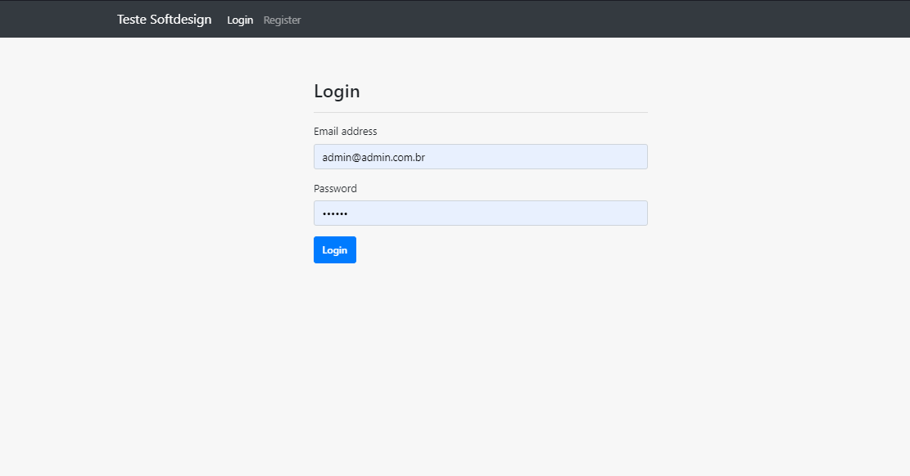
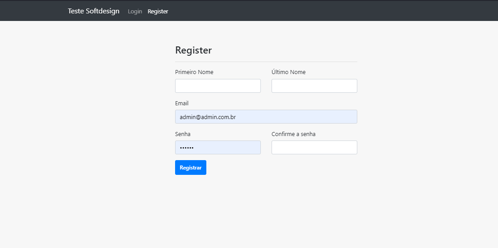
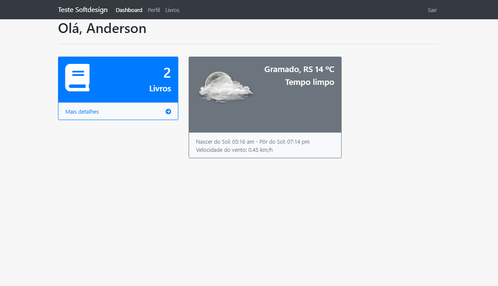
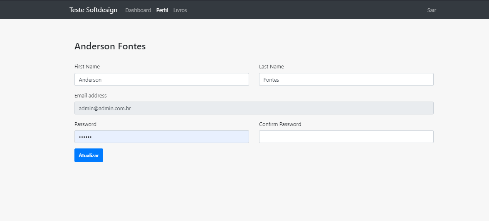
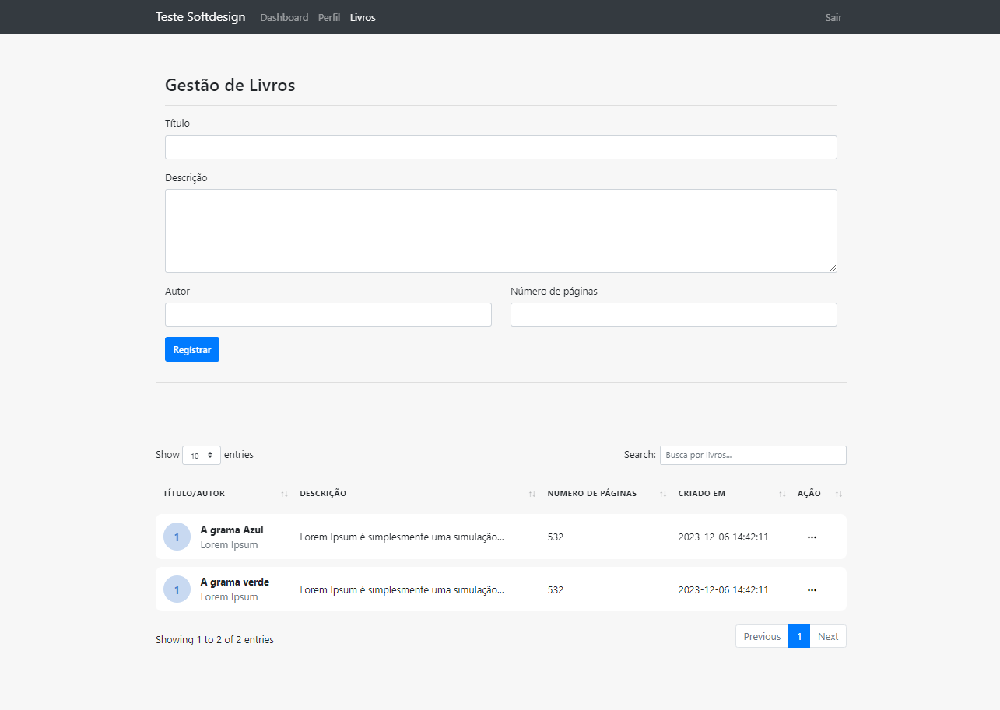
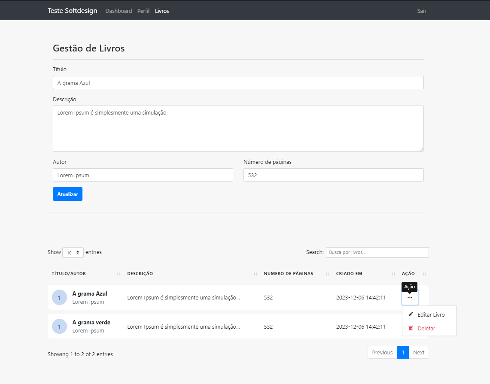
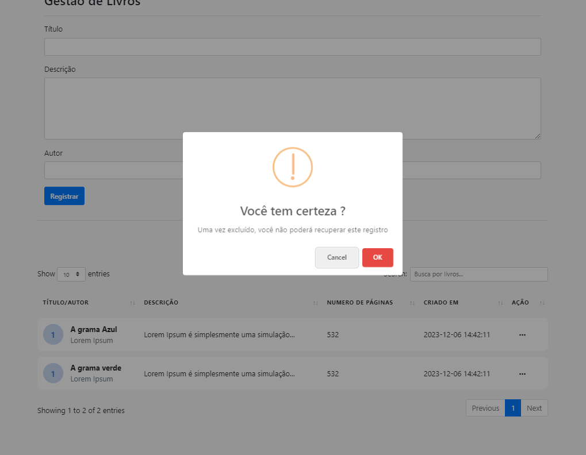

# CodeIgniter 4 Login & gestão de livros
Teste softdesign
## 1. Setup
Altere as configurações do arquivo .env para seu desenvolvimento
para executar com o docker ou o php spark serve alterar no .env a baseURL

## 2. Execute a migration
Via terminal rode o seguinte comando
> php spark migrate

# Prints do projeto

